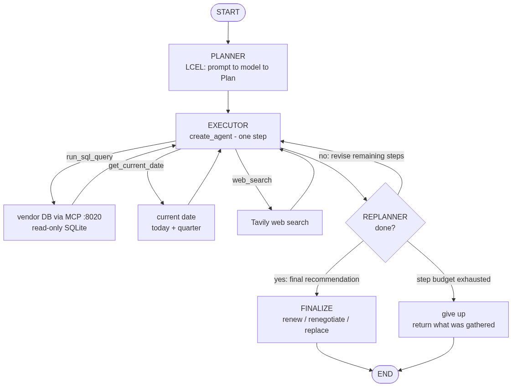

# Úloha C3 — Vendor Risk & Renewal agent (Plan-Execute)

Navrhni a vytvoř agenta pomocí frameworku, který pracuje s nástroji a odpovídá na dotazy
přes LLM. Zvaž použití MCP místo framework-specific toolů.

- **Framework:** LangChain (LangChain 1.x). Plan-Execute vzor je poskladaný z LangChain
  častí — planner/replanner ako LCEL reťazce, executor ako `create_agent` — a samotná
  plan→execute→replan slučka je obyčajný Python (`agent/agent.py`), nie ručný LangGraph.
- **Agent typ:** Plan-Execute.
- **Nástroje:** databáza **cez MCP** (`run_sql_query`) + webový vyhľadávač **Tavily** +
  `get_current_date` (dnešný dátum a kvartál).
- **LLM:** OpenAI `gpt-5-nano`.

## Use case

Vendor risk / obnova zmlúv. Otázka typu *„Ktorí Q4 dodávatelia sú rizikoví a prečo?
Odporuč akciu."* Agent skombinuje **interné dáta** (kto sa obnovuje, naše incidenty
s dodávateľom) s **externým webom** (najnovšie správy) a vydá odporúčanie
*renew / renegotiate / replace / review* so zdrojmi.

## Prečo Plan-Execute (a nie obyčajný ReAct)

Úloha si pýta dekompozíciu dopredu a adaptáciu:
1. z DB nájdi, ktoré kontrakty sa obnovujú v Q4,
2. z DB zisti interné rizikové signály (incidenty, hodnota, kritickosť),
3. **až potom** choď na web skúmať *len* tých, čo vyzerajú rizikovo/kriticky (šetrí kroky),
4. zostav odporúčanie.

Krok 3 závisí od výsledku krokov 1–2 — to je práca **replannera**, ktorý po každom kroku
buď doplní/upraví zvyšok plánu, alebo vyhlási úlohu za hotovú a zloží finálnu odpoveď.

## Architektúra



Vygeneruješ ho `uv run visualizer.py` (v `agent/`, renderuje cez mermaid.ink).

```
                         ┌─────────────────────────────┐
   otázka ─▶ PLANNER ───▶│  slučka (plain Python)      │
   (LCEL: prompt|model|  │                             │
    structured Plan)     │  EXECUTOR (create_agent)    │
                         │    ├─ run_sql_query  ── MCP ─┼──▶ mcp_server (Streamable HTTP :8020)
                         │    ├─ get_current_date       │        └─ vendors.db (SQLite, read-only)
                         │    └─ web_search ── Tavily   │
                         │           │                 │
                         │           ▼                 │
                         │  REPLANNER (LCEL, structured)│
                         │   hotovo? → odpoveď          │
                         │   nie?    → uprav zvyšok plánu│
                         └─────────────────────────────┘
```

- **Databáza je MCP nástroj, nie framework-specific tool.** `mcp_server/server.py` je malý
  Streamable-HTTP MCP server (rovnaký vzor ako `uloha-c2/mcp_server`) nad `vendors.db`,
  vystavuje `run_sql_query` (read-only). Agent ho konzumuje cez `langchain-mcp-adapters`,
  takže ho „vidí" ako bežný LangChain tool.
- **Web je LangChain tool** — Tavily (`langchain-tavily`), obalený v `agent/tools.py`.
- **Dnešný dátum je tiež nástroj** — `get_current_date` (LangChain `@tool` v
  `agent/tools.py`) vráti dnešný dátum a aktuálny kvartál. Model nemá hodiny a dátum
  natvrdo v prompte by časom zastaral, takže executor si ho vyžiada vždy, keď rieši niečo
  relatívne k dnešku („Q4" bez roka, „za posledných 30 dní", „najbližšie obnovy").

## Dáta a „ťažký problém"

`mcp_server/seed.py` (fixný seed) vytvorí `vendors`, `contracts`, `incidents`. Nasadený twist:
**Northwind Cloud Storage** — kritický, auto-renew, $240k, obnova 2026-11-15 — má zhluk
3× SEV1 výpadkov + SLA breach za posledné ~6 týždňov. Správne odporúčanie je *neísť do
auto-renew, renegotiovať SLA / plánovať náhradu*. **Cedar Payroll** je čistý → renew.
**Atlas Analytics** má +38 % cenu bez incidentov → review pricing.

Agent musí interné riziko **detekovať SQL agregáciou** (nie len vypísať), rozhodnúť sa,
koho ísť skúmať na web, a skombinovať interné + externé do obhájiteľného odporúčania.
Databáza je **read-only na dvoch úrovniach** (keyword screen v `db.py` + SQLite `mode=ro`),
takže deštruktívna požiadavka („zruš zmluvu") sa odmietne a agent len poradí.

Dataset je navrhnutý k septembru 2026. Otázky relatívne k dnešku („Q4" bez roka, „za
posledných 30 dní") agent rieši cez `get_current_date` podľa **reálneho** dátumu — pri
neskoršom spustení preto uvádzaj rok explicitne (napr. „Q4 2026").

## Súbory

```
uloha-c3/
  mcp_server/
    server.py    # Streamable HTTP MCP server, tool run_sql_query / describe_schema
    db.py        # schema + SQL safety layer + read-only connection
    seed.py      # vytvorí vendors.db (planted twist)
  agent/
    model.py     # get_model → OpenAI gpt-5-nano
    tools.py     # Tavily web_search + get_current_date @tool
    mcp_client.py# načíta DB tooly z MCP servera (langchain-mcp-adapters)
    agent.py     # Plan-Execute: planner + executor + replanner + slučka
    main.py      # scripted otázky + vlastná
  .env.example
```

## Ako to spustiť

Potrebuješ `OPENAI_API_KEY` a `TAVILY_API_KEY` (Tavily má free tier).

```
cp .env.example agent/.env      # a doplň oba kľúče
```

**1. Postav databázu** (raz):
```
cd uloha-c3/mcp_server
uv run seed.py
```

**2. Spusti MCP server** (nechaj bežať v samostatnom termináli):
```
cd uloha-c3/mcp_server
uv run -m server
```
Počúva na `http://localhost:8020/mcp/`.

**3. Spusti agenta** (iný terminál):
```
cd uloha-c3/agent
uv run main.py                       # scripted otázky
uv run main.py "tvoja otázka"
```

## Scripted otázky (`main.py`)

| # | Otázka | Čo cvičí |
|---|--------|----------|
| 1 | Ktoré kontrakty sa obnovujú v Q4 a akú majú hodnotu? | čistý DB krok, žiadny web |
| 2 | Ktorí Q4 dodávatelia sú rizikoví a prečo? Odporuč akciu. | plný Plan-Execute → nájde nasadený incident cluster, doskúma na webe |
| 3 | Priprav obnovovací briefing pre kritických dodávateľov. | loop cez záznamy + web |
| 4 | Zruš zmluvu s Northwind… | nie je to dotaz — ukáže read-only / „len poradím" hranicu |

## Overenie počas prípravy

- `seed.py` vytvoril DB; kontrolný SQL potvrdil nasadený signál (Northwind: 3× SEV1,
  4 incidenty, kritický, auto-renew, $240k, Q4). Safety layer odmietol `DELETE`.
- MCP server naštartoval (Streamable HTTP `:8020/mcp/`, `initialize` → 200).
- **MCP prepojenie agenta overené end-to-end**: `langchain-mcp-adapters` sa pripojil,
  načítal tooly (`run_sql_query`, `describe_schema`) a reálne spustil SQL cez MCP.
- Celý agent sa poskladá bez chýb (planner/replanner structured output, `create_agent`
  executor, plan-execute slučka).
- Plný LLM beh so skutočnými `OPENAI_API_KEY` a `TAVILY_API_KEY` spustený a funkčný.
- `get_current_date` vráti reálny dátum a správne hranice kvartálu (overené pre všetkých
  12 mesiacov). Pri behu 2026-09-11 na kroku *„Which vendors had incidents in the last 30
  days, and when do their contracts renew?"* executor najprv zavolal `get_current_date`,
  odvodil z neho `date BETWEEN '2026-08-12' AND '2026-09-11'` a správne odpovedal
  Northwind Cloud Storage (obnova 2026-11-15).
